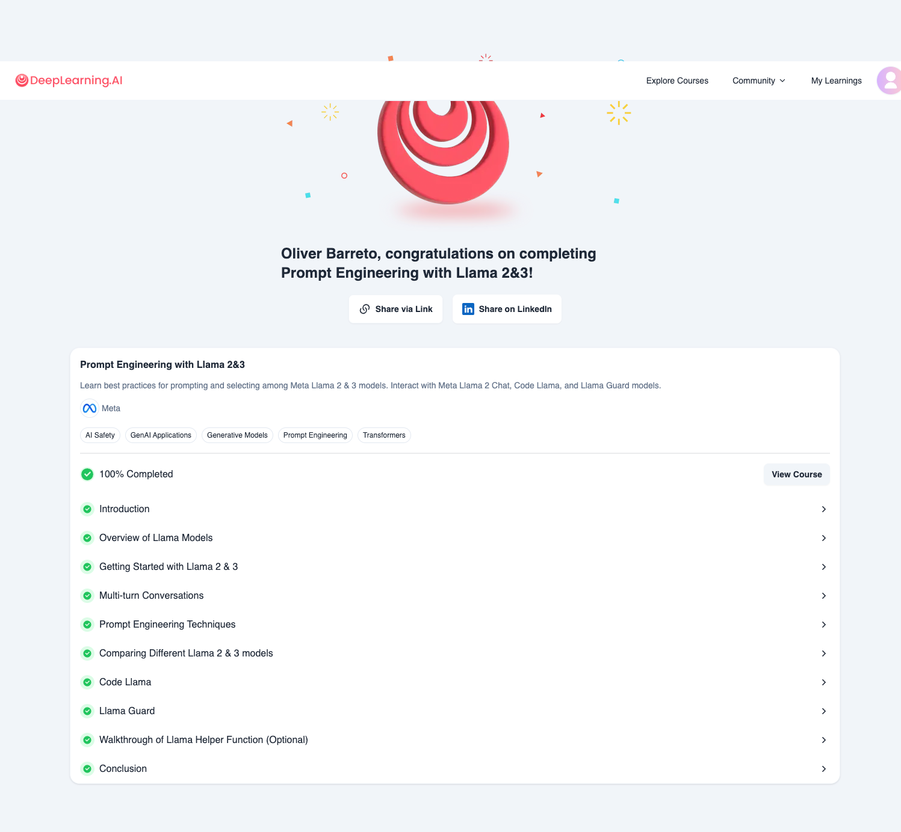

# DeepLearning.AI - Course - Meta - Prompt Engineering with Llama 2&amp;3

- Course Online: https://learn.deeplearning.ai/courses/prompt-engineering-with-llama-2/
- Git repo: [deeplearning.ai.meta.promptengineering.llama2-3](https://github.com/oliverbarreto/deeplearning.ai.meta.promptengineering.llama2-3.git)
- Jupiter Notebooks of the course
- Finished: 15 diciembre 2024

# Lessons:
1. Introduction
2. Overview of Llama Models (Code)
3. Getting Started with Llama 2 & 3 (Code)
4. Multi-turn Conversations (Code)
5. Prompt Engineering Techniques (Code)
6. Comparing Different Llama 2 & 3 models (Code)
7. Code Llama (Code)
8. Llama Guard (Code)
9. Walkthrough of Llama Helper Function (Optional)
10. Conclusion

